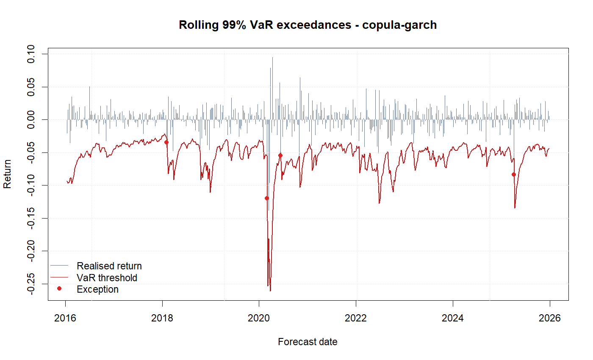
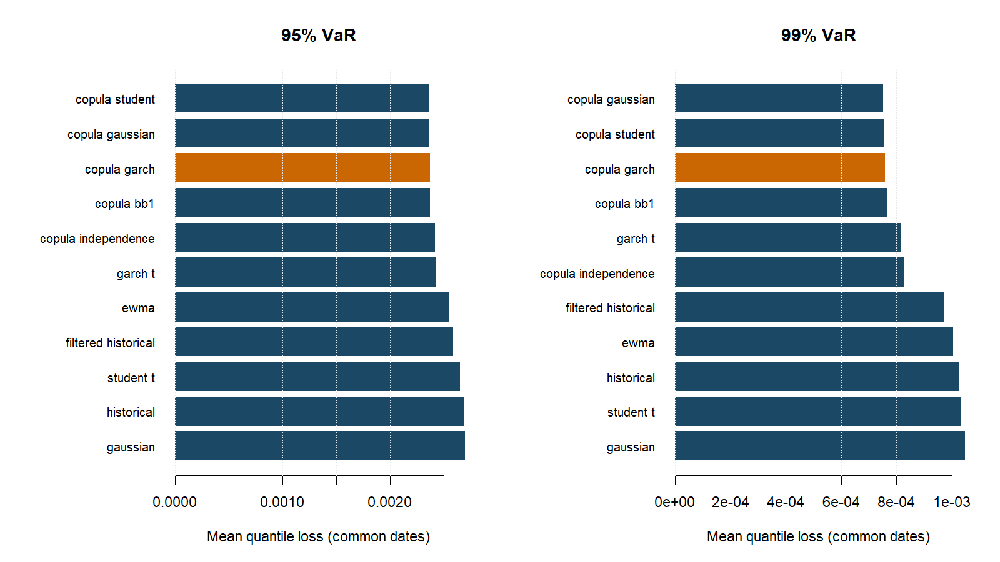

# Portfolio Risk Analytics

A reproducible **two-asset market-risk research framework** in R: conditional
volatility, copula dependence, Monte Carlo VaR/ES, and rolling out-of-sample evaluation.

The research question is whether conditional volatility and asymmetric dependence
improve forecasts enough to justify their complexity. Predictive losses and uncertainty
are reported separately from runtime; a rank or large p-value is not proof of superiority.

## New in v0.2

- Shared Friday valuations preserve cross-market holiday weeks, with source quote
  dates, staleness checks, and explicit rejection of missing weeks.
- Exact empirical ES handles ties and fractional tail probability. Signed risk
  estimates are retained for statistical scoring.
- Common-date VaR/ES comparisons preserve missing observations in transition tests
  and report forecast availability separately.
- A portfolio **GARCH-t benchmark** and **fixed-marginal copula ablations** distinguish
  volatility modelling from dependence modelling.
- Paired circular-block bootstrap intervals, centred bootstrap p-values, and Holm
  adjustment accompany predictive loss differences.
- Input snapshots, content-aware caches, source/config hashes, and output checksums
  support reproducibility and auditing.

The v0.1 results are superseded: exact-date intersections omitted some holiday weeks,
so their estimates and ranks should not be interpreted as validated weekly results.

## Run

Use **R 4.5.1** to reproduce the checked environment. The package declares R >= 4.2,
but the full dependency lock includes packages requiring R >= 4.4.

```r
install.packages("renv")
renv::restore()
source("scripts/run_tests.R")
source("scripts/run_smoke_test.R")
source("scripts/run_validation.R")
source("scripts/run_full_analysis.R")
```

Verify the committed results without restoring packages or downloading data:

```sh
Rscript --vanilla scripts/audit_outputs.R
```

Smoke uses explicitly synthetic fixtures. Validation and full profiles use real Yahoo
data cached locally. Full models require the locked `rugarch` and `VineCopula` packages.
Quarto is needed for the final HTML report; a portable executable may be placed under
`tools/`. CSV and PNG outputs remain usable without rendering.

## Experiment

`config/full.yml` uses 50/50 FTSE/S&P 500 local-index returns, a compact ARMA-GARCH grid,
100,000 current-risk draws, 10,000 rolling draws, a 520-observation moving estimation
window, and 520 evaluation dates including the 2020 market shock.

Benchmarks: historical, Gaussian, Student-t, EWMA, filtered historical, and univariate
portfolio GARCH-t. The copula-GARCH model periodically reselects specifications and
refits every origin. Independence/Gaussian/Student/BB1 ablations reuse the same
conditional marginal fits at each origin, isolating dependence assumptions.

Evaluation reports full-calendar availability and coverage, common-date quantile and
joint VaR/ES (FZ0) scores, and paired differences against GARCH-t. Bootstrap intervals
are marginal, depend on serial-dependence/block-length assumptions, and do not correct
for hyperparameter tuning on the holdout. There is no arbitrary composite accuracy,
runtime and complexity ranking. Loss ranks describe this sample only.

## Generated evidence

The validated run covers **520 weekly forecast dates (2016-01-15 to 2025-12-26)**:
11 models, two confidence levels and **11,440 successful forecast rows**.
Copula-GARCH's observed quantile losses are 2.12% and 6.80% lower than GARCH-t at
95% and 99% confidence. However, all four quantile/FZ0 loss-difference intervals
cross zero, with Holm-adjusted p-values of 1. This experiment does **not establish
incremental predictive value over GARCH-t**. See [STATUS.md](STATUS.md) for the
numerical evidence and validation record.





Key tables under `outputs/tables/`:

- `model_comparison.csv`: coverage, availability and common-date VaR/ES scores.
- `predictive_comparison.csv`: paired differences, bootstrap intervals and adjusted p-values.
- `predictive_scores.csv`: per-date model/reference scores and differences.
- `valuation_audit.csv`: valuation cutoffs, actual quote dates and staleness.
- `run_provenance.csv`: source revision, exact sample, settings and dependency versions.
- `output_manifest.csv`: output checksums and sizes.

`STATUS.md` records completed validation. Each run also archives its frozen price
snapshot, YAML, session information, tables and figures under ignored
`outputs/runs/<run_id>/`. Full raw downloads and binary snapshots remain local;
the committed valuation audit includes the weekly prices and their quote dates.
Generated CSV bytes are preserved in Git so manifest checksums survive checkout.
Re-downloading historical data can change results; `renv.lock` freezes software,
not market data.

## Conventions and limitations

- Negative returns are losses. `loss_var/loss_es` are signed loss-scale estimates used
  for scoring; `var/es` are nonnegative display magnitudes. VaR is a quantile, not a
  maximum loss. ES averages the exact worst tail probability mass.
- Asset log returns are converted to simple returns before portfolio weighting and
  then back to the configured return space. Weights reset each observation; costs
  and a holdings-based rebalancing ledger are not modelled.
- The example combines **local-currency index returns**, not an investable GBP
  portfolio. The currency helper accepts aligned FX returns; runners do not acquire FX.
- Copulas are bivariate. Native fallbacks cover fewer models and support offline
  verification; they are not interchangeable with the production likelihood engine.
- Fitted-sample PIT KS/AD p-values are exploratory and do not gate model admission.
  Residual diagnostics remain screening heuristics, not proof of model correctness.
- FZ0 requires positive signed loss ES. Unscorable observations are counted explicitly.
  Comparative scoring is not a formal standalone ES calibration test. Even 520 dates
  provide limited information about rare 99% exceptions.

## Structure

```text
R/                 data, modelling, simulation, evaluation and reporting
config/            smoke, validation and full experiment profiles
scripts/           runnable entry points
tests/testthat/    regression and numerical validation tests
report/            generated Quarto report
vignettes/         methodology
outputs/           committed results and ignored runtime artefacts
```

`_targets.R` tracks configuration, local-input content, generated files and report
dependencies. Set `PRA_CONFIG` before `targets::tar_make()` to choose a profile.

MIT. See [LICENSE.md](LICENSE.md).
