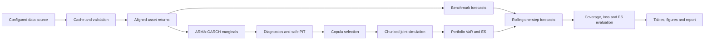
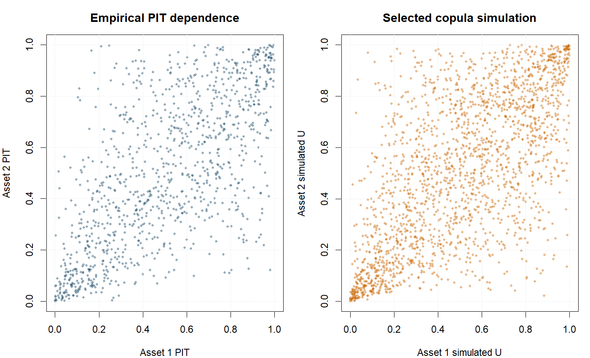

# Portfolio Risk Analytics Engine

A reproducible market-risk modelling and backtesting framework combining conditional
volatility models, copula-based dependence, Monte Carlo simulation, Value-at-Risk (VaR),
Expected Shortfall (ES), and rolling out-of-sample evaluation.

> VaR and ES are positive loss magnitudes throughout. VaR is a loss-quantile threshold,
> not a maximum loss.

## Why this project matters

Static risk estimates can look precise while failing under changing volatility, heavy
tails, or clustered cross-asset losses. This project treats risk estimation as a complete
forecasting system: validated inputs, conditional marginals, dependence, simulation,
one-step forecasts, statistical evaluation, failure accounting, and reproducible outputs.

## Core capabilities

- Cached local/online data acquisition with metadata and offline fallback.
- Daily or weekly alignment, simple/log returns, explicit currency modes, and validated
  fixed weights.
- Historical, Gaussian, Student-t, EWMA, and filtered-historical benchmarks.
- Configuration-driven ARMA-sGARCH/eGARCH grids with non-Gaussian innovations.
- Residual and squared-residual diagnostics plus safe PIT transformation.
- Gaussian, Student-t, Clayton, Gumbel, Frank, BB1, and rotated copula interfaces.
- Chunked copula Monte Carlo with deterministic seeds and 95%/99% VaR and ES.
- Moving or expanding one-step rolling forecasts with checkpoints and resume.
- Kupiec and Christoffersen tests, pinball loss, descriptive ES diagnostics, and joint
  VaR/ES scoring.

## Pipeline architecture



## Methods and supported models

Marginal candidates combine configured ARMA orders with sGARCH, eGARCH, and optionally
gjrGARCH variance models and normal, Student-t, skewed Student-t, GED, or skewed GED
innovations. Production fits use `rugarch` when installed; unsupported fallback candidates
remain visible as failures. Dependence candidates use `VineCopula` when available, with
native Gaussian and Student-t implementations for deterministic software validation.

Model selection first removes non-converged or invalid fits, applies diagnostics as
validity checks, and only then ranks eligible models by AIC/BIC. It never maximizes a
Ljung-Box p-value.

## Repository structure

```text
R/                 package modules
config/            smoke, validation, and full YAML profiles
scripts/           thin executable entry points
tests/testthat/     network-free unit and integration tests
data/               project-local raw, processed, cache, and fixtures
outputs/            generated tables, figures, models, backtests, and logs
report/             Quarto report reading generated outputs
vignettes/          methodology documentation
```

## Installation and quick start

R 4.2 or newer is required. Restore the project library and run the smoke profile:

```r
install.packages("renv")
renv::restore()
source("scripts/run_smoke_test.R")
```

The smoke profile uses explicitly synthetic fixture data for software verification. It
does not claim real-market estimates.

## Validation and full runs

Validation downloads real adjusted market data once and caches it locally:

```r
source("scripts/run_validation.R")
```

The full profile uses 100,000 draws for the current-risk estimate, a separately budgeted
rolling simulation, broader model grids, checkpoints, and the copula-GARCH rolling model:

```r
source("scripts/run_full_analysis.R")
```

Set `data.force_refresh: true` only when a fresh download is intended.

## Tests

```r
source("scripts/run_tests.R")
```

Tests use deterministic fixtures and do not require live network access.

## Outputs and verified validation results

Successful runs generate machine-readable CSV tables and PNG figures under `outputs/`.
The snapshot below comes from the real-data `validation.yml` run completed on 2026-07-18:
1,082 aligned weekly price observations from 2005-01-07 through 2025-12-30, local-index-
return mode, and 20,000 current-risk simulations. It is not an FX-adjusted investable
portfolio result.

| Result | Verified output |
|---|---:|
| FTSE marginal | ARMA(0,0)-eGARCH(2,1), skewed Student-t |
| S&P 500 marginal | ARMA(0,1)-eGARCH(2,1), skewed Student-t |
| Selected copula | BB1; Kendall tau 0.4786 |
| Tail dependence | lower 0.5579; upper 0.3120 |
| 95% VaR / ES | 2.1897% / 3.0627% |
| 99% VaR / ES | 3.5846% / 4.4023% |

All 288 marginal candidates converged; 120 passed every configured diagnostic. All six
copula candidates fitted successfully. In the 156-period benchmark evaluation, the
multi-criterion rank placed Student-t first at 95% (3 exceptions; mean quantile loss
0.001998) and Gaussian first at 99% (1 exception; mean quantile loss 0.000734). These
ranks combine calibration and loss with runtime/complexity; they are not declarations
based on a single p-value.




Headline artefacts are:

- `outputs/figures/rolling_var_exceedances.png`
- `outputs/figures/model_comparison.png`
- `outputs/figures/copula_diagnostic.png`
- `outputs/tables/current_copula_risk.csv`
- `outputs/tables/model_comparison.csv`

## Backtesting framework

At forecast origin `t`, the model sees observations only through `t` and is scored against
`t + 1`. The comparison table reports exception rate, Kupiec unconditional coverage,
Christoffersen independence and conditional coverage, quantile loss, average VaR/ES,
tail loss, runtime, failure count, and a multi-criterion rank. No single p-value defines
the best model.

## Reproducibility

Three YAML profiles control dates, assets, currencies, weights, model grids, diagnostics,
windows, simulation budgets, seeds, and workers. `renv.lock` captures dependencies;
`_targets.R` provides dependency-aware orchestration; runner scripts provide an explicit
fallback. Downloads, logs, checkpoints, and model objects remain project-local.

## Limitations

- The default cross-index example uses local-index-return mode: index returns are abstract
  return series and no FX conversion is claimed. Base-currency mode requires aligned FX
  returns supplied with the documented quote convention.
- Native model fallbacks cover a deliberately smaller statistically valid subset than the
  optional production packages.
- ES evaluation currently provides descriptive tail residuals and a joint scoring rule,
  not a formal ES hypothesis test.
- Current implementation is bivariate for copula simulation; the data and return layers
  support arbitrary asset counts.

## Roadmap

- Generalise pair-copula construction to higher-dimensional vines.
- Add transaction costs and scheduled rebalancing.
- Add formal comparative predictive-ability tests and validated ES hypothesis tests.
- Add a fully hedged base-currency demonstration with cached FX data.

## License

MIT. See [LICENSE.md](LICENSE.md).
